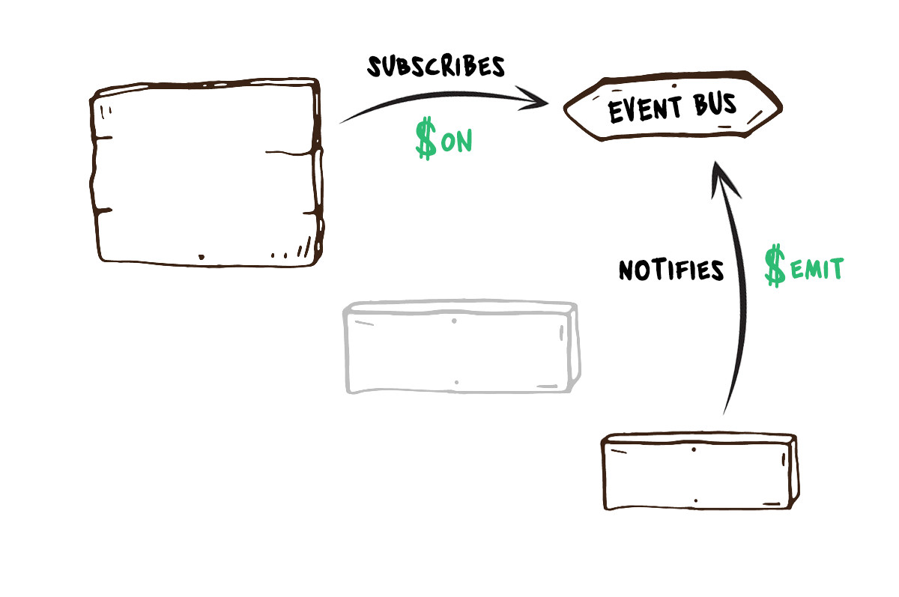

# 관계 없는 컴포넌트 간 통신

&nbsp;

**이벤트 버스** 를 이용하여 관계 없는 컴포넌트 간 데이터를 전송할 수 있다.



&nbsp;

```html
<html>
    <body>
        
        <div id="app">
            <component-a></component-a>
            <component-b></component-b>
        </div>

        <script src="https://cdn.jsdelivr.net/npm/vue@2.5.2/dist/vue.js"></script>
        <script>

            // 이벤트 버스
            var eventBus = new Vue(); /* (1) */

            // 컴포넌트 A
            var componentA = {
                template: '<div><button v-on:click="btnClick">버튼</button></div>',
                methods: {
                    btnClick() {
                        eventBus.$emit('valueEventBus', 10); /* (2) */
                    }
                }
            };

            // 컴포넌트 B
            var componentB = {
                template: '<div></div>',
                mounted() {
                    eventBus.$on('valueEventBus', function(value) { /* (3) */
                        console.log(value)
                    })
                }
            };


            //부모 컴포넌트
            new Vue({
                el: '#app',
                data: {
                },
                components: {
                    'component-a': componentA,
                    'component-b': componentB
                }
            });

        </script>
    </body>
</html>
```

&nbsp;

(1) : 이벤트 버스로 사용할 Vue 객체 생성  
(2) : 'valueEventBus' 이벤트 발생 (param : 10)
(3) : 'valueEventBus' 이벤트 선언

&nbsp;

**결과**

버튼 클릭 시 `10` 로그 출력.

&nbsp;

장점 : props 속성을 이용하지 않고 원하는 컴포넌트 어디든지 데이터를 전달할 수 있다.

단점 : 컴포넌트가 많아지면 관리가 어려움.