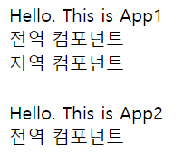

## 전역 컴포넌트와 지역 컴포넌트

```html
<html>
    <body>
        <div id="app1">
            {{message}}
            <global-component></global-component>
            <local-component></local-component>
        </div>

        <br/>

        <div id="app2">
            {{message}}
            <global-component></global-component>
            <local-component></local-component>
        </div>


        <script src="https://cdn.jsdelivr.net/npm/vue@2.5.2/dist/vue.js"></script>
        <script>
            //전역 컴포넌트
            Vue.component('global-component', {
                template : '<div>전역 컴포넌트</div>'
            });

            //지역 컴포넌트
            var localComponent = {
                template: '<div>지역 컴포넌트</div>'
            };

            new Vue({
                el: '#app1',
                data: {
                    message: 'Hello. This is App1'
                },
                components: { //지역 컴포넌트 등록
                    'local-component': localComponent
                }
            });

            new Vue({
                el: '#app2',
                data: {
                    message: 'Hello. This is App2'
                },
            });

        </script>
    </body>
</html>
```

&nbsp;

**결과**



&nbsp;

전역 컴포넌트 : Vue.component()

&nbsp;

지역 컴포넌트 : components 등록 후 사용 가능.

&nbsp;
&nbsp;


전역 컴포넌트를 쓸 일이 있을까. 나는 개발할 때 지역 컴포넌트만 썼는데..
